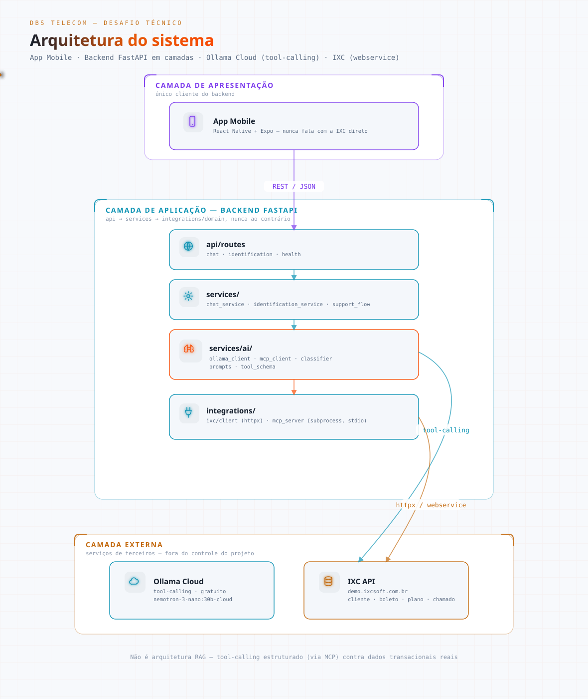
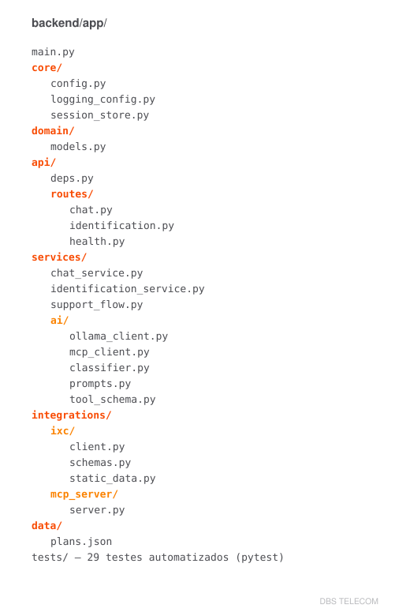
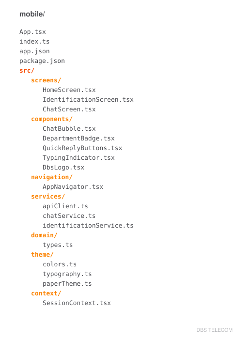
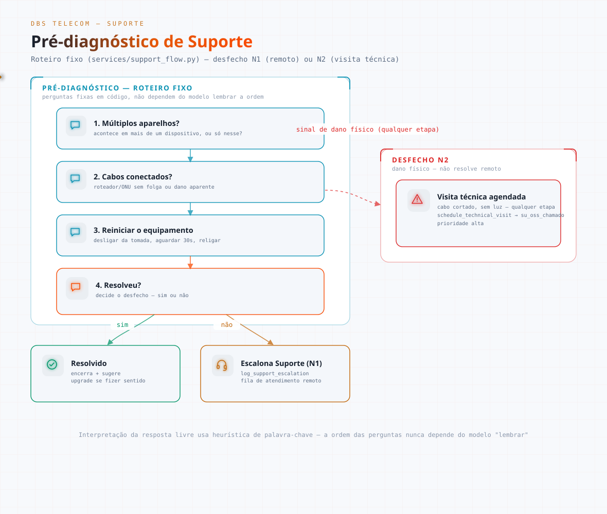

# DBS TELECOM — Assistente Virtual (Desafio Técnico)

**Engenheiro de Software:** Daniel Faria


MVP de aplicativo mobile com chat inteligente para a DBS TELECOM: identifica o cliente na IXC,
entende o pedido via linguagem natural e encaminha automaticamente para **Comercial**, **Suporte**
ou **Financeiro** — com pré-diagnóstico real no Suporte (não só roteamento cego) e consulta de
boleto de verdade no Financeiro.

**Objetivo:** permitir que um cliente da DBS TELECOM converse naturalmente pelo app e seja
identificado, entendido e resolvido (ou corretamente encaminhado) sem precisar navegar um menu ou
esperar um atendente humano para o que é resolvível na hora — usando dado real da IXC em toda
resposta, nunca inventado.

## Sumário

- [Arquitetura](#arquitetura)
- [Estrutura do projeto](#estrutura-do-projeto)
- [Como rodar](#como-rodar)
- [Teste guiado](#teste-guiado)
- [Variáveis de ambiente](#variáveis-de-ambiente)
- [Ollama: host vs Docker vs nuvem](#ollama-host-vs-docker-vs-nuvem)
- [Integração com a IXC](#integração-com-a-ixc)
- [Fluxos implementados](#fluxos-implementados)
- [Segurança](#segurança)
- [Testes](#testes)
- [Convenções de clean code do projeto](#convenções-de-clean-code-do-projeto)
- [Limitações conhecidas](#limitações-conhecidas)

---

## Arquitetura

<picture>
  <source media="(prefers-color-scheme: dark)" srcset="docs/arquitetura-dark.svg">
  <source media="(prefers-color-scheme: light)" srcset="docs/arquitetura-light.svg">
  
</picture>

O app mobile **nunca** fala diretamente com a IXC — só com o backend próprio. O token da IXC só
existe dentro do container/processo do backend (variável de ambiente).

| Componente | Tecnologia | Papel |
|---|---|---|
| App Mobile | React Native + Expo | Único cliente do backend — identificação, chat, badge de departamento |
| `api/routes` | FastAPI | Traduz HTTP ⇄ chamada de serviço, sem lógica de negócio |
| `services/` | Python | Orquestração: classificação de departamento, loop de chat, máquina de estados de Suporte |
| `services/ai/` | Python + Ollama SDK | Cliente do Ollama (tool-calling), cliente MCP, prompts por departamento, classificador |
| `integrations/mcp_server` | MCP (SDK oficial) | Servidor MCP — expõe a IXC como *tools* (subprocess, transporte stdio) |
| `integrations/ixc` | httpx assíncrono | Cliente HTTP da IXC — único código do projeto que conhece a URL/token da IXC |
| Ollama Cloud | Ollama | Inferência do modelo de IA, tool-calling |
| IXC API | Webservice IXC | Sistema de ERP/faturamento da DBS — dado real de cliente, boleto, plano, chamado |

Isso **não é uma arquitetura RAG** — não há busca semântica/vetorial em documentos. É tool-calling:
o Ollama chama ferramentas estruturadas (via MCP) que consultam a IXC diretamente. RAG faria
sentido se, no futuro, o assistente precisasse responder perguntas livres buscando numa base de
artigos/FAQ — não é o caso aqui, os dados são registros transacionais estruturados (cliente,
boleto, plano).

### Tecnologias e justificativa

| Camada | Tecnologia | Por quê |
|---|---|---|
| Mobile | React Native + Expo | Framework real de app mobile (gera APK/iOS de verdade), grande ecossistema de bibliotecas, componentização natural |
| UI | React Native Paper | Componentes Material prontos e acessíveis, tema customizável com a paleta da marca sem gastar tempo montando design system do zero |
| Backend | Python + FastAPI | Assíncrono nativo (bom para orquestrar chamadas a IXC/Ollama em paralelo), tipagem com Pydantic, gera OpenAPI automaticamente |
| IA | Ollama (`nemotron-3-nano:30b-cloud`) | Gratuito, com suporte a tool-calling confiável — atende o requisito de usar IA sem depender de API paga |
| Protocolo de ferramentas | MCP (Model Context Protocol) | Pedido explícito do desafio — abstrai a IXC como um servidor de ferramentas reutilizável, desacoplado do backend |
| Integração IXC | httpx assíncrono | Cliente HTTP moderno, mesma stack assíncrona do FastAPI |

---

## Estrutura do projeto

<picture>
  <source media="(prefers-color-scheme: dark)" srcset="docs/arvore-backend-dark.svg">
  <source media="(prefers-color-scheme: light)" srcset="docs/arvore-backend-light.svg">
  
</picture>

<picture>
  <source media="(prefers-color-scheme: dark)" srcset="docs/arvore-mobile-dark.svg">
  <source media="(prefers-color-scheme: light)" srcset="docs/arvore-mobile-light.svg">
  
</picture>

**Backend em camadas** — dependência sempre numa direção só:

| Camada | Responsabilidade |
|---|---|
| `api/` | Apresentação — só traduz HTTP ⇄ chamada de serviço |
| `services/` | Aplicação — orquestração e regras de negócio da conversa (depende de `integrations/` e `domain/`) |
| `services/ai/` | Subpacote de `services/` — tudo que é especificamente "conversar com o Ollama/MCP" (cliente HTTP do Ollama, cliente MCP, conversão de schema de tools, prompts, classificação) |
| `integrations/` | Infraestrutura — tudo que fala com sistemas externos (IXC, servidor MCP). Depende só de `domain/` |
| `domain/` | Modelos e enums, sem lógica de infraestrutura |
| `core/` | Transversal — config, logging, estado de sessão |

`api → services → integrations/domain`, nunca ao contrário.

---

## Como rodar

### Pré-requisitos

- Python 3.12+
- Node.js 20+
- Uma forma de rodar o Ollama — **não precisa instalar nada localmente** se for usar o Ollama Cloud (padrão do projeto, ver [Ollama: host vs Docker vs nuvem](#ollama-host-vs-docker-vs-nuvem)); se preferir local, [instale o Ollama](https://ollama.com) e baixe o modelo: `ollama pull qwen2.5:7b`
- Docker (opcional — ver seção [Ollama: host vs Docker vs nuvem](#ollama-host-vs-docker-vs-nuvem))
- Expo Go instalado no celular (mais rápido para ver o app rodando) **ou** Android Studio com emulador configurado

### 1. Backend

```bash
cd backend
python -m venv .venv
.venv\Scripts\activate          # Windows
# source .venv/bin/activate     # Linux/Mac

pip install -r requirements.txt

copy .env.example .env          # Windows
# cp .env.example .env          # Linux/Mac
# edite o .env com o IXC_TOKEN real e, se for usar Ollama Cloud, o OLLAMA_API_KEY

python -m uvicorn app.main:app --host 0.0.0.0 --port 8000 --reload
```

Testar: `curl http://localhost:8000/health` → `{"status":"ok"}`

`--host 0.0.0.0` é necessário para o app mobile (rodando no celular) conseguir alcançar o backend
pela rede local — sem isso, só o próprio PC consegue chamar a API.

### 2. Backend via Docker (alternativa)

```bash
docker compose up --build
```

Por padrão sobe só o container `api`, apontando para o Ollama do **host** (ver próxima seção). Requer `backend/.env` preenchido antes.

### 3. Mobile

```bash
cd mobile
npm install
copy .env.example .env          # Windows — edite EXPO_PUBLIC_API_URL com o IP da sua máquina na rede local
npx expo start
```

Escaneie o QR code com o app **Expo Go** no celular (mesma rede Wi-Fi do computador). **Importante**: `EXPO_PUBLIC_API_URL` precisa ser o IP da máquina na rede local (ex: `http://192.168.0.10:8000`), nunca `localhost` — o celular não entende "localhost" como sendo o computador.

### 4. Gerar o APK

O endereço do backend não fica fixo no `.apk` gerado: o app tem uma tela de configuração (ícone de
engrenagem na Home) onde dá pra digitar e testar o IP do backend em tempo de execução, sem precisar
gerar um novo build pra apontar pra outro servidor — a configuração fica salva no aparelho.

O projeto já vem configurado (`mobile/eas.json`) para build via [EAS](https://docs.expo.dev/build/introduction/) — só falta autenticar, o que exige uma conta Expo (gratuita) e login interativo, por isso não é algo que dá pra automatizar sem a sua conta:

```bash
cd mobile
npx eas-cli login          # abre o navegador pra login na conta Expo
npx eas-cli build --platform android --profile preview   # gera o .apk (build na nuvem, gratuito)
```

Alternativa sem depender da nuvem da Expo: build local, mas exige Android SDK + **JDK 17+** instalados na máquina (não tínhamos JDK 17+ disponível neste ambiente ao testar):

```bash
npx expo run:android --variant release
```

### 5. Testes automatizados

```bash
cd backend
pytest                                    # 29 testes, mockados, não tocam rede
RUN_LIVE_IXC_TESTS=1 pytest tests/test_ixc_client_live.py -v   # opcional: valida contra a IXC real
```

---

## Teste guiado

Depois de rodar o backend e o app, veja o [TESTE_GUIADO.md](TESTE_GUIADO.md) — um roteiro passo a
passo (identificação, Comercial, Financeiro, Suporte nos três desfechos N1/N2, casos de robustez)
com um contato de teste real e o que esperar em cada etapa.

---

## Variáveis de ambiente

### `backend/.env` (ver `.env.example` completo)

| Variável | Obrigatória | Descrição |
|---|---|---|
| `IXC_TOKEN` | ✅ | Token da API da IXC. **Nunca commitar** — só em `.env`, que está no `.gitignore`. |
| `IXC_BASE_URL` | | URL base da API webservice da IXC |
| `OLLAMA_BASE_URL` | | Ver [Ollama: host vs Docker vs nuvem](#ollama-host-vs-docker-vs-nuvem) |
| `OLLAMA_MODEL` | | Modelo usado (`nemotron-3-nano:30b-cloud` por padrão, via Ollama Cloud) |
| `OLLAMA_API_KEY` | Só p/ Ollama Cloud | Chave grátis gerada em [ollama.com/settings/keys](https://ollama.com/settings/keys). Deixe em branco rodando localmente. |
| `OLLAMA_TIMEOUT_SECONDS` | | 180s por padrão — dá folga pro "cold start" do modelo |

### `mobile/.env`

| Variável | Descrição |
|---|---|
| `EXPO_PUBLIC_API_URL` | URL do backend. IP da LAN para testar em dispositivo físico, nunca `localhost`. |

---

## Ollama: host vs Docker vs nuvem

**Testamos as três formas de verdade, não só na teoria — e há diferenças reais de performance e de requisito de hardware:**

| Modo | Como funciona | Observação medida |
|---|---|---|
| Host (fora do Docker) | Usa a aceleração disponível na máquina (GPU, se houver) | Respostas em poucos segundos, nos nossos testes |
| Docker Desktop (`--profile containerized-ollama`) | Sem passagem de GPU configurada | Cai pra **CPU-only**: ~21 tokens/s, sessão de chat com ~1400 tokens de contexto — o suficiente pra passar de 1 minuto por resposta em alguns casos e esbarrar em timeout |
| **Ollama Cloud** (padrão do projeto) | `https://ollama.com`, nada instalado localmente | Tier gratuito, "uso leve" (rate limited, mas suficiente pro MVP). Alternativa direta para quem não tem GPU/RAM suficiente pra carregar o modelo (`qwen2.5:7b` local precisa de ~2,5 GB de RAM livre só pra carregar, e nem sempre está disponível) |

**Configuração usada por padrão neste projeto**: Ollama Cloud, com o modelo
`nemotron-3-nano:30b-cloud` — gratuito ("uso leve", mesmo tier do `gpt-oss:20b`), com tool-calling
confiável e português mais limpo. Comparamos os dois modelos gratuitos rodando o mesmo roteiro de
teste (Comercial/Suporte/Financeiro): o `gpt-oss:20b` ocasionalmente misturava inglês no meio da
resposta e inventou um desconto que não existia no catálogo; o `nemotron-3-nano:30b-cloud` não
repetiu nenhum dos dois problemas nos testes — por isso é o padrão atual (`gpt-oss:20b` continua
funcional como alternativa). `qwen3.5:cloud` também foi testado e **exige plano pago** (confirmado
direto na API, apesar de alguma documentação de terceiros sugerir o contrário).

Se preferir rodar localmente (sem depender de internet/nuvem), troque no `.env`:

```bash
# Local, backend fora do Docker
OLLAMA_BASE_URL=http://localhost:11434
OLLAMA_MODEL=qwen2.5:7b
OLLAMA_API_KEY=

# Local, backend em Docker, Ollama no host
OLLAMA_BASE_URL=http://host.docker.internal:11434
OLLAMA_MODEL=qwen2.5:7b
OLLAMA_API_KEY=
```

Ou tudo 100% dentro do Docker (sem precisar instalar Ollama na máquina):

```bash
docker compose --profile containerized-ollama up
```

Nesse caso, troque `OLLAMA_BASE_URL` no `.env` para `http://ollama:11434` (o `.env.example` documenta os quatro cenários possíveis, com os prós/contras de cada um).

---

## Integração com a IXC

Toda a integração fica isolada em `backend/app/integrations/ixc/` — é a única parte do sistema que conhece a URL/token da IXC.

**Autenticação**: `Authorization: Basic base64(<token>)` — o token da IXC já contém as duas partes (não é `usuario:senha`), então se faz `base64` só do token puro.

**Padrão de consulta**: POST para `/webservice/v1/<tabela>`, header `ixcsoft: listar`, corpo `{"qtype": "<tabela>.<campo>", "query": "<valor>", "oper": "=", ...}`.

**Descoberta importante, confirmada testando contra o ambiente demo real**: a IXC guarda telefone e CPF/CNPJ **formatados** (`(64) 99823-4471`, `024.403.310-23`), não como dígitos puros — uma busca só com dígitos retorna zero resultados. O cliente normaliza a entrada do usuário para o formato brasileiro padrão antes de consultar (`app/integrations/ixc/client.py`, funções `_format_telefone`/`_format_cpf_cnpj`).

### Operações implementadas

| Operação | Tabela IXC | Observação |
|---|---|---|
| Identificar cliente (telefone/CPF) | `cliente` | ✅ Validado com dado real |
| Consultar boleto em aberto | `fn_areceber` | ✅ Validado — filtra `status == "A"` no lado do cliente |
| Consultar contratos/plano ativo | `cliente_contrato` | Implementado, não exercitado no fluxo principal |
| Abrir chamado de Suporte (N1) | `su_oss_chamado` | ✅ Validado com inserts de teste reais na IXC |
| Agendar visita técnica (N2) | `su_oss_chamado` | ✅ Mesma tabela, `id_assunto` diferente ("VISTORIA TECNICA (OS)") |

**Campos do `su_oss_chamado`** — descobertos por tentativa/erro guiado pelas mensagens de validação
da própria IXC e, depois, comparando um chamado criado pelo sistema com um chamado de referência
real (visível corretamente no painel): `status="A"` (Aberta), `setor="7"` (Setor Técnico) e
`tipo="C"` (Corretiva) são os valores que a IXC reconhece — os primeiros valores usados
(`status="N"`, `setor="1"`, `tipo="A"`) criavam o chamado, mas com esses campos em branco no
painel, invisível nos filtros padrão da fila de Suporte. Os IDs de `id_assunto` usados (6 =
"Lentidão", 22 = "VISTORIA TECNICA (OS)") e o de `setor` (7) são específicos do catálogo **desse
ambiente demo** — numa instalação diferente da IXC, precisam ser reconferidos em Suporte > Assuntos
/ Configurações > Setores no painel admin.

### Tratamento de erros

| Exceção | Quando |
|---|---|
| `IXCUnavailableError` | Timeout, erro de rede, ou HTTP 5xx |
| `IXCAuthError` | Token rejeitado |
| `IXCNotFoundError` | Consulta OK, zero resultados |
| `IXCMalformedResponseError` | Resposta em formato inesperado |
| `IXCValidationError` | IXC recusou a criação de um registro por campo obrigatório ausente — descoberta real: a IXC responde HTTP 200 mesmo quando rejeita a criação, o corpo da resposta é que indica o erro |

As tools do MCP capturam todas essas exceções e devolvem um payload estruturado de erro para o modelo, que responde de forma conversacional ("não consegui acessar seus dados agora") em vez de travar o atendimento.

---

## Fluxos implementados

### 1. Identificação
`POST /api/identify {contact}` → IXC localiza o cliente por telefone ou CPF → cria a sessão e já devolve a saudação personalizada.

### 2. Comercial
Classificação → loop de tool-calling do Ollama com acesso a `list_plans` (catálogo estático, `data/plans.json`) e `get_customer_plan` (plano atual do cliente na IXC). Ao listar planos, cada um aparece com o nome em negrito numa linha própria (ex: **IDEAL DBS 500MB** — 500MB, R$ 119,90) para facilitar a leitura no chat.

### 3. Suporte (com pré-diagnóstico real)
Não escalona direto. Roda uma máquina de estados determinística (`services/support_flow.py`) com o roteiro fixo exigido:

<picture>
  <source media="(prefers-color-scheme: dark)" srcset="docs/fluxo-suporte-dark.svg">
  <source media="(prefers-color-scheme: light)" srcset="docs/fluxo-suporte-light.svg">
  
</picture>

**Desfecho N1 vs N2**: se em qualquer etapa o cliente mencionar sinal de dano físico ("cabo cortado", "sem luz no equipamento", ou até algo mais vago como "meu cabo tá com problema"), o fluxo pula direto para o agendamento de visita técnica (N2) em vez de insistir em passos remotos que não resolveriam. Se os passos remotos não resolverem sem sinal de dano físico, escalona para a fila de Suporte (N1). As perguntas em si são fixas (não dependem do modelo "lembrar" de perguntar tudo) — só a interpretação da resposta do cliente usa heurística de palavra-chave.

Ao confirmar que o problema foi resolvido, o atendimento consulta o plano real do cliente e sugere um upgrade de forma leve — só se fizer sentido (nunca inventa plano ou preço).

**Trocar de assunto a qualquer momento**: o cliente pode pedir outro departamento (ex: "quero falar com financeiro") a qualquer momento da conversa, inclusive no meio de um diagnóstico de Suporte em andamento — o sistema detecta e troca, em vez de travar permanentemente no departamento anterior.

### 4. Financeiro
Classificação → tool `get_boleto` consulta a IXC e retorna valor/vencimento reais. Instrução explícita no prompt para nunca inventar link/código de barras nem prometer envio por WhatsApp/e-mail (o sistema não tem essa capacidade de verdade) quando o campo vem vazio — bugs reais encontrados e corrigidos durante os testes.

---

## Segurança

| Proteção | Como |
|---|---|
| Token da IXC nunca exposto | Só existe em `backend/.env` (gitignored) — nunca hardcoded, nunca chega ao app mobile |
| Integração isolada | `app/integrations/ixc/` é o único código que conhece a URL/token da IXC |
| Transporte MCP local | stdio (subprocess), não expõe porta de rede |
| Log sem segredo | `app/core/logging_config.py` redige automaticamente qualquer campo `authorization`/`token` |
| `customer_id` nunca decidido pela IA | O backend injeta o id do cliente já identificado na sessão antes de qualquer chamada de ferramenta que dependa dele — evita o modelo alucinar ou vazar dado de outro cliente |
| Sem promessa vazia | Prompts nunca prometem uma ação (enviar boleto por WhatsApp, agendar algo) que o sistema não executa de verdade — achado real durante os testes, corrigido |

---

## Testes

| Comando | O que roda |
|---|---|
| `pytest` | 29 testes unitários — mockados (respx), não tocam rede |
| `RUN_LIVE_IXC_TESTS=1 pytest tests/test_ixc_client_live.py -v` | 2 testes de integração real contra a IXC demo — opt-in, exige `.env` válido |

```bash
cd backend
pytest -v
```

Cobertura: cliente IXC (sucesso, não encontrado, timeout, resposta malformada, formato do header
de auth), classificador por palavra-chave (incluindo troca de departamento e sinal vago de dano
físico), máquina de estados de Suporte (ordem não pode ser pulada, "não resolveu" não pode ser
confundido com "resolveu", sinal de dano físico pula pra N2, upgrade sugerido pós-resolução), store
de sessão.

---

## Convenções de clean code do projeto

- **Organização por regions**: cada arquivo (backend e mobile) usa `# region`/`# endregion` (ou
  `// #region`) para agrupar blocos relacionados — tipos, helpers privados, fluxo público.
- **Ordem alfabética**: funções dentro de uma classe/arquivo seguem ordem alfabética entre si,
  facilitando encontrar uma função sem precisar ler o arquivo inteiro.
- **Docstring em toda função**: o que ela faz e o que retorna — sem exceção, incluindo helpers
  privados.
- **Camadas de dependência única direção**: `api → services → integrations/domain`, nunca ao
  contrário (ver [Estrutura do projeto](#estrutura-do-projeto)). `services/ai/` concentra tudo que
  é "conversar com o Ollama/MCP", separado dos dois pontos de entrada (`chat_service.py`,
  `identification_service.py`) e do fluxo de negócio de Suporte (`support_flow.py`).
- **Prompts anti-alucinação, com exemplos negativos concretos**: cada prompt de IA tem regras
  explícitas contra inventar dado — não só "nunca invente", mas exemplos do que já deu errado em
  teste real (ex: "não diga 'desconto de até X%' quando não vier da ferramenta"), porque instrução
  genérica sozinha não impediu o modelo de alucinar uma vez.
- **Nunca prometer o que o sistema não faz de verdade**: se um prompt promete uma ação (enviar
  boleto por WhatsApp, agendar visita), tem que existir uma ferramenta real por trás fazendo
  aquilo — achado real durante os testes (ver [Segurança](#segurança)), corrigido removendo a
  promessa em vez de deixar o texto "bonito" mas falso.
- **Máquina de estados determinística para roteiro obrigatório**: o pré-diagnóstico de Suporte usa
  perguntas fixas em código, não depende do modelo "lembrar" de perguntar tudo na ordem certa —
  reserva a IA pra interpretação de linguagem natural e julgamento qualitativo, não pra
  sequenciamento que precisa ser sempre correto.
- **Validação contra o sistema real, não só teste mockado**: toda integração com a IXC foi
  validada com consulta direta à API (não só confiando no que o modelo respondeu) antes de
  considerar um fluxo pronto — vários bugs reais (campos em branco, promessa vazia, mensagem em
  inglês) só apareceram assim, não em teste unitário.

---